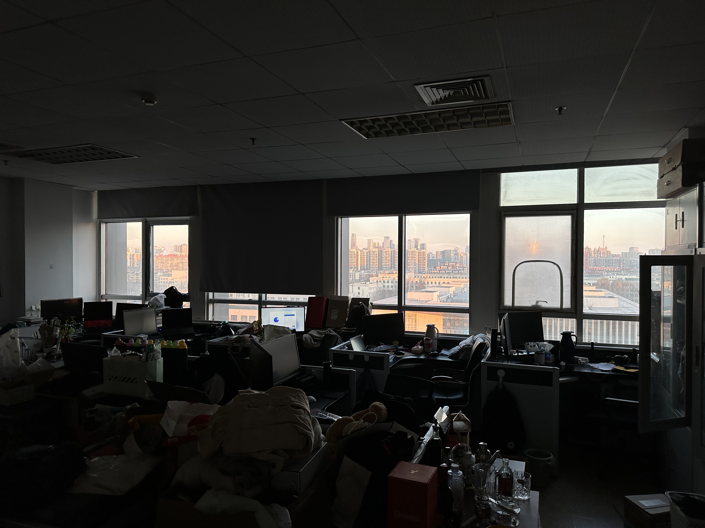

# 大大的论文 

## 定义一：何为好的学位论文？（如何学位论文高分？）

硕士学位专业大论文是<strong>防御性</strong>写作。
> 防御性写作：无需在内容上有非常大的革新，但是需要保证论文**不要有语病、不要出现低级错误**

## 定义二：何为成果？（论文与成果的关系）

论文是成果的展现形式。成果其实是自己研究生三年（博士四年）在相关领域提出的创新性方法。

在与人交流时，对成果与论文的表述应该为：
* ”我有三个研究成果“
* “我用成果发表了3篇SCI一区论文”

因此不要因为没有论文而否定自己没有成果，论文能发表说明自己的成果被期刊论文认可，通过满足期刊发表要求。

## 定义三：最后一章的验证分析
普遍来说大家都会放平台介绍，但正确的小章节安排应该为：
* 平台介绍
* 在平台验证结果（能否包含前面所有章节）

## 问题一：在审论文需要写上吗？
个人建议是：要，多写无妨，少写可能吃亏。

> 整体章节的**成果支撑要分散**

## 问题二：参考文献有没有具体要求？
参考文献要求：
* 不少于40篇，不多于150篇
* 中文参考文献20-30篇
* 参考文献中近五年内的文献数应不少于总数的1/3，并应有近两年内的文献

参考文献格式具体要看[国标GB/T 7714-2015](https://lib.tsinghua.edu.cn/wj/GBT7714-2015.pdf)。

## 问题三：每个章节的页面设置？
* 每个章节要从奇数页开始，偶数页结束。*不满足的需要在结尾空页（不推荐）*
* 不要用大的空白页面
* 图与正文、表与正文的空隙不能使用回车，应该通过<strong>调整段落间距实现正文和图表的分割</strong>

## 盲审论文时候老师视角带入
审稿时间约为15-30mins，顺序：

1. 阅读摘要
2. 看成果总结
3. 图的风格是否一致
4. 排版有没有错误，格式错误
5. 每一章引言是否对应每一章结尾，每一章结尾是否能被下一章引言承接

## 注意
1. 每个章节名称应该差不多，每个小章节设置也应该差不多
2. 变量需要一统一

---

<strong>欢迎补充，预祝大家顺利完成论文，通过答辩，开启下一段人生篇章</strong>🎉

